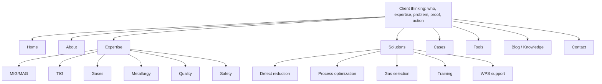

# ReDesign.md: план редизайна навигации

## 1. Цель

Подготовить сайт PersonalHomePage к редизайну навигации и информационной архитектуры в стиле B2B engineering consulting.

Главная задача: заменить навигацию, построенную вокруг технических блоков проекта, на навигацию, отражающую ход мысли клиента:

1. Кто эксперт.
2. В чем его инженерная экспертиза.
3. Какие производственные задачи он решает.
4. Чем подтверждается опыт.
5. Какие инструменты доступны.
6. Где читать материалы.
7. Как связаться.

После внедрения структура сайта должна восприниматься как профиль инженерного консультанта, а не как список всех внутренних секций главной страницы.

## 2. Принцип новой архитектуры

Навигация должна отражать не структуру кода, а структуру мышления клиента.

Было:

- разделы главной страницы вынесены в отдельный dropdown;
- `Ключевые компетенции`, `Формат работы`, `Практические ситуации`, `Результаты для бизнеса` конкурируют за один уровень внимания;
- `Blog` и `Knowledge` существуют рядом как похожие верхнеуровневые сущности;
- `Book` находится в меню на том же уровне, что и основные клиентские сценарии.

Должно стать:

- 7-8 верхнеуровневых пунктов максимум;
- каждая сущность имеет один смысл;
- технические направления объединены в `Expertise`;
- прикладная работа объединена в `Solutions`;
- доказательства опыта вынесены в `Cases` и `About`;
- инженерные калькуляторы остаются отдельным продуктовым разделом `Tools`.

## 3. Новое основное меню

Целевая структура `Header`:

| Пункт | URL | Назначение |
| --- | --- | --- |
| `Home` | `/` | Главная: hero, краткое позиционирование, обзор ключевых блоков. |
| `About` | `/about` | Биография, IWE, 10+ лет опыта, краткое упоминание книги. |
| `Expertise` | `/#expertise` | Объединенная инженерная экспертиза. |
| `Solutions` | `/#solutions` | Практические задачи, которые решаются для производства. |
| `Cases` | `/#cases` | Реальные инженерные ситуации в формате Problem -> Solution -> Result. |
| `Tools` | `/tools` | Инженерные калькуляторы. |
| `Blog / Knowledge` | `/blog` или `/knowledge` | Статьи, инженерные материалы и SEO-контент. |
| `Contact` | `/contact` | Email, LinkedIn, YouTube, форма связи через `mailto`. |

Важно: `Blog` и `Knowledge` не должны одновременно быть отдельными соседними пунктами верхнего меню. Для верхнего уровня нужен один объединенный пункт. Если сохраняются обе страницы, одна из них должна стать основной, а вторая - внутренней ссылкой или фильтром.

## 4. Dropdown-логика

### 4.1. Expertise

`Expertise` ведет на `/#expertise` и может иметь dropdown с якорями внутри одной страницы.

Рекомендуемые пункты:

| Пункт dropdown | Якорь | Содержание |
| --- | --- | --- |
| `MIG/MAG` | `/#expertise-mig-mag` | MIG/MAG welding, WPS/pWPS, стабильность процесса. |
| `TIG` | `/#expertise-tig` | TIG welding, aluminium, stainless steel, снижение дефектов. |
| `Gases` | `/#expertise-gases` | Shielding gases, fuel gases, расход и подбор смесей. |
| `Metallurgy` | `/#expertise-metallurgy` | Welding metallurgy, тепловложение, поведение металла. |
| `Quality` | `/#expertise-quality` | Quality control & inspection, дефекты и контроль процесса. |
| `Safety` | `/#expertise-safety` | Safety in gas systems, безопасная работа с газами. |

Это не отдельные страницы. Это секции или якоря внутри объединенного блока `Expertise`.

### 4.2. Solutions

`Solutions` ведет на `/#solutions` и может иметь dropdown с якорями внутри одной страницы.

Рекомендуемые пункты:

| Пункт dropdown | Якорь | Содержание |
| --- | --- | --- |
| `Defect reduction` | `/#solutions-defect-reduction` | Снижение дефектов сварки. |
| `Process optimization` | `/#solutions-process-optimization` | Оптимизация сварочных процессов. |
| `Gas selection` | `/#solutions-gas-selection` | Подбор защитных и горючих газов. |
| `Training` | `/#solutions-training` | Обучение сварщиков и производственного персонала. |
| `WPS support` | `/#solutions-wps-support` | Внедрение стабильных WPS/pWPS. |

`Solutions` отвечает на вопрос клиента: "Какие производственные проблемы можно решить?"

## 5. Что объединить или убрать из меню

Из верхнего меню убрать или переработать:

- `Ключевые компетенции` -> входит в `Expertise`;
- `Формат работы` -> входит в `Solutions`;
- `Практические ситуации и решения` -> становится `Cases`;
- `Результаты для бизнеса` -> входит в `Solutions` или обзорный блок главной;
- `Book` -> остается на странице `/book` при необходимости, но не является обязательным пунктом верхнего меню;
- пара `Blog` + `Knowledge` -> один пункт `Blog / Knowledge`.

Внутри сайта эти страницы и блоки могут сохраняться, если они нужны для SEO или детального контента. Ограничение относится к верхнеуровневой навигации.

## 6. Главная после редизайна

Главная страница остается, но перестает повторять структуру меню как длинный список равнозначных разделов.

Рекомендуемый порядок блоков:

1. `Hero`
2. `About summary`
3. `Expertise overview`
4. `Solutions overview`
5. `Cases preview`
6. `Tools preview`
7. `CTA / Contact`

Допустимые дополнительные блоки:

- `Experience` как короткое подтверждение доверия;
- `Book` как короткий экспертный артефакт;
- `Blog` как 2-3 последних материала.

Эти блоки не должны создавать новые пункты верхнего меню и не должны конкурировать с `Expertise`, `Solutions`, `Cases`.

## 7. Целевая схема IA



## 8. Карта реализации по файлам

### 8.1. `frontend/components/Header.tsx`

Текущее состояние:

- есть `homeSectionLinks` с якорями главной;
- есть dropdown `Home sections`;
- есть `navRest` с `Tools`, `Blog`, `Knowledge`, `Book`, `Contact`;
- mobile menu повторяет ту же перегруженную структуру.

Что изменить:

- удалить dropdown `Home sections`;
- заменить структуру меню на целевые пункты из раздела 3;
- добавить отдельные массивы:
  - `expertiseLinks`;
  - `solutionLinks`;
  - `primaryNavLinks`;
- добавить dropdown для `Expertise`;
- добавить dropdown для `Solutions`;
- в mobile menu использовать ту же IA, что и в desktop;
- закрывать mobile menu при клике по любому пункту dropdown.

Рекомендуемая модель данных:

```ts
const expertiseLinks = [
  { href: '/#expertise-mig-mag', key: 'expertiseMigMag' },
  { href: '/#expertise-tig', key: 'expertiseTig' },
  { href: '/#expertise-gases', key: 'expertiseGases' },
  { href: '/#expertise-metallurgy', key: 'expertiseMetallurgy' },
  { href: '/#expertise-quality', key: 'expertiseQuality' },
  { href: '/#expertise-safety', key: 'expertiseSafety' },
] as const;

const solutionLinks = [
  { href: '/#solutions-defect-reduction', key: 'solutionDefectReduction' },
  { href: '/#solutions-process-optimization', key: 'solutionProcessOptimization' },
  { href: '/#solutions-gas-selection', key: 'solutionGasSelection' },
  { href: '/#solutions-training', key: 'solutionTraining' },
  { href: '/#solutions-wps-support', key: 'solutionWpsSupport' },
] as const;
```

### 8.2. `frontend/app/[locale]/page.tsx`

Что изменить:

- `Section id="competencies"` -> `Section id="expertise"`;
- внутренние якоря технических карточек привести к `expertise-*`;
- `Section id="services"` -> `Section id="solutions"`;
- внутренние якоря решений привести к `solutions-*`;
- `Section id="cases"` сохранить;
- CTA внутри `Solutions` оставить направленным на `/contact`;
- CTA внутри `Cases` может вести на `/experience`, если страница опыта сохраняется как детальная.

Важно: не создавать отдельные страницы для `MIG/MAG`, `TIG`, `Gases`, `Metallurgy`, `Quality`, `Safety`.

### 8.3. `frontend/messages/en.json`

Добавить или обновить ключи в `common`:

```json
{
  "solutions": "Solutions",
  "cases": "Cases",
  "blogKnowledge": "Blog / Knowledge",
  "expertiseMigMag": "MIG/MAG",
  "expertiseTig": "TIG",
  "expertiseGases": "Gases",
  "expertiseMetallurgy": "Metallurgy",
  "expertiseQuality": "Quality",
  "expertiseSafety": "Safety",
  "solutionDefectReduction": "Defect reduction",
  "solutionProcessOptimization": "Process optimization",
  "solutionGasSelection": "Gas selection",
  "solutionTraining": "Training",
  "solutionWpsSupport": "WPS support"
}
```

Также обновить тексты `home`:

- `competenciesTitle` -> смысл `Expertise`;
- `servicesTitle` -> смысл `Solutions`;
- `casesTitle` -> смысл `Cases`.

### 8.4. `frontend/messages/ru.json`

Добавить или обновить ключи в `common`:

```json
{
  "solutions": "Решения",
  "cases": "Кейсы",
  "blogKnowledge": "Блог / знания",
  "expertiseMigMag": "MIG/MAG",
  "expertiseTig": "TIG",
  "expertiseGases": "Газы",
  "expertiseMetallurgy": "Металлургия",
  "expertiseQuality": "Качество",
  "expertiseSafety": "Безопасность",
  "solutionDefectReduction": "Снижение дефектов",
  "solutionProcessOptimization": "Оптимизация процессов",
  "solutionGasSelection": "Подбор газов",
  "solutionTraining": "Обучение",
  "solutionWpsSupport": "Поддержка WPS"
}
```

Также обновить тексты `home`:

- `competenciesTitle`: `Экспертиза`;
- `servicesTitle`: `Решения для производства`;
- `casesTitle`: `Кейсы`.

### 8.5. `frontend/messages/lv.json`

Добавить или обновить ключи в `common`:

```json
{
  "solutions": "Risinājumi",
  "cases": "Piemēri",
  "blogKnowledge": "Blogs / zināšanas",
  "expertiseMigMag": "MIG/MAG",
  "expertiseTig": "TIG",
  "expertiseGases": "Gāzes",
  "expertiseMetallurgy": "Metalurģija",
  "expertiseQuality": "Kvalitāte",
  "expertiseSafety": "Drošība",
  "solutionDefectReduction": "Defektu samazināšana",
  "solutionProcessOptimization": "Procesu optimizācija",
  "solutionGasSelection": "Gāzu izvēle",
  "solutionTraining": "Apmācība",
  "solutionWpsSupport": "WPS atbalsts"
}
```

Также обновить тексты `home`:

- `competenciesTitle`: `Ekspertīze`;
- `servicesTitle`: `Risinājumi ražošanai`;
- `casesTitle`: `Piemēri`.

### 8.6. `frontend/components/HomeSectionProgress.tsx`

Сейчас компонент отслеживает старые id:

- `why-choose`;
- `about`;
- `competencies`;
- `services`;
- `cases`;
- `experience`;
- `book`;
- `tools`;
- `blog`;
- `contact`.

После редизайна возможны два варианта:

1. Сократить до клиентской IA:
   - `about`;
   - `expertise`;
   - `solutions`;
   - `cases`;
   - `tools`;
   - `contact`.
2. Удалить компонент с главной, если он дублирует header и увеличивает когнитивную нагрузку.

Предпочтительный вариант: сократить, если компонент визуально полезен; удалить, если он выглядит как второе меню.

### 8.7. `frontend/components/Footer.tsx`

Footer должен поддерживать ту же смысловую архитектуру, что и Header.

Что изменить:

- убрать ссылки на старые якоря `/#competencies` и `/#services`;
- заменить их на `/#expertise` и `/#solutions`;
- не держать одновременно `Blog` и `Knowledge` как равнозначные пункты, если Header показывает один объединенный пункт;
- `Book` и `Experience` допускаются как вторичные ссылки, но не как основные клиентские CTA.

### 8.8. `frontend/i18n/navigation.ts`

Изменений может не потребоваться, потому что `createNavigation(routing)` уже поддерживает локализованный `Link`.

Проверить:

- корректность ссылок вида `/#expertise`;
- корректность ссылок вида `/#solutions-defect-reduction`;
- поведение при переходах из `/ru/about` на `/ru/#expertise`.

## 9. Routing и страницы

Существующие страницы можно сохранить:

- `/about`;
- `/tools`;
- `/blog`;
- `/knowledge`;
- `/contact`;
- `/experience`;
- `/book`.

Но верхнеуровневая навигация не должна показывать все страницы одновременно.

Рекомендуемая логика:

- `/about` остается основной страницей биографии, квалификации IWE, опыта и книги;
- `/experience` остается детальной страницей опыта и кейсов, но из Header ведет только `Cases`, если это действительно нужно;
- `/book` остается доступной из блока About или footer, но не из главного меню;
- `/knowledge` либо объединяется с `/blog`, либо становится внутренней страницей из `Blog / Knowledge`.

## 10. UX-требования

Header должен быть:

- минималистичным;
- без повторов смыслов;
- с 7-8 пунктами максимум;
- понятным без знания структуры проекта;
- ориентированным на B2B-клиента, руководителя производства, инженера, технолога или HR.

Навигационные подписи должны быть короткими:

- `Expertise`, а не `Key Competencies`;
- `Solutions`, а не `How I work`;
- `Cases`, а не `Practical situations and solutions`;
- `Tools`, а не `Engineering calculators` в верхнем меню;
- `Blog / Knowledge`, а не два отдельных пункта.

## 11. Критерии готовности

Редизайн навигации считается выполненным, если:

- Header содержит не больше 8 верхнеуровневых пунктов.
- Dropdown `Home sections` удален.
- Нет смысловых дублей `Blog`/`Knowledge`, `Competencies`/`Expertise`, `Services`/`Solutions`.
- `Expertise` объединяет весь технический контент.
- `Solutions` объединяет прикладные производственные задачи.
- `MIG/MAG`, `TIG`, `Gases`, `Metallurgy`, `Quality`, `Safety` не являются отдельными страницами.
- `Defect reduction`, `Process optimization`, `Gas selection`, `Training`, `WPS support` не являются отдельными страницами.
- `#expertise`, `#solutions`, `#cases` работают во всех локалях.
- Desktop header, mobile menu и footer используют одну IA.
- Пользователь понимает структуру сайта за 5 секунд.

## 12. Минимальный план проверки после реализации

В PowerShell:

```powershell
Set-Location .\frontend
npm run dev
```

Проверить вручную:

- `/en`, `/ru`, `/lv`;
- desktop header;
- mobile menu;
- dropdown `Expertise`;
- dropdown `Solutions`;
- переходы на `/#expertise`, `/#solutions`, `/#cases`;
- переходы на `/about`, `/tools`, `/blog` или `/knowledge`, `/contact`;
- отсутствие старого dropdown `Home sections`;
- отсутствие верхнеуровневого `Book`, если цель минимизации меню сохраняется;
- единообразие Header и Footer.

После изменений в коде дополнительно выполнить:

```powershell
Set-Location .\frontend
npm run lint
```

Если lint-команда в проекте отличается, использовать команду из `frontend/package.json`.

## 13. Результат внедрения

После реализации сайт должен восприниматься как B2B consulting-профиль инженера по сварке:

- понятное позиционирование эксперта;
- быстрый доступ к компетенциям;
- ясное разделение между expertise и business solutions;
- меньше когнитивной нагрузки;
- больше доверия за счет кейсов, опыта, IWE и инженерных инструментов;
- структура сайта становится логичной для клиента, а не для разработчика.
