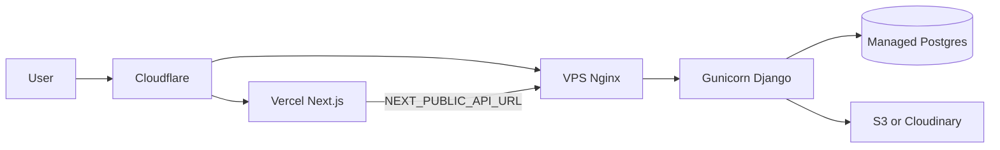

# Аудит готовности к деплою

Дата аудита: 24 июля 2026

## Вердикт

**К production-деплою сейчас не готово.** Код сайта и API в целом собраны и работают локально, но Фаза 5 в [Plan.md](Plan.md) целиком не закрыта: нет production-процесса (Gunicorn/Nginx), CI/CD, health-check, безопасных Django-дефолтов и гарантированной раздачи медиа при `DEBUG=False`. Плюс незакоммиченный WIP по legal (Terms + миграции 0043/0044).

Целевая схема из плана (её и стоит довести):

---

## Что уже в порядке

- Монорепо: [frontend/](frontend/) (Next.js 16 + next-intl) + [backend/](backend/) (Django 5 + DRF)
- Публичные API для сайта подключены (pages, blog, tools/calculators, leads, content/seo)
- CMS-миграция контента в Django Admin, cookie consent opt-in, legal-страницы privacy/cookie-policy/terms в коде
- Leads: honeypot + rate limit; Brevo webhook fail-closed без секрета
- `.env` в `.gitignore` + pre-commit `block-env-commit` / `detect-private-key`
- S3-хранилище уже заложено в [backend/config/settings.py](backend/config/settings.py) через django-storages
- SEO helpers, sitemap/robots, локали `en`/`ru`/`lv`

---

## Блокеры деплоя (Critical)

| # | Проблема | Где |
|---|----------|-----|
| 1 | `DEBUG` по умолчанию `True`, insecure `SECRET_KEY` fallback | [backend/config/settings.py](backend/config/settings.py) L15–16; [.env.example](.env.example) |
| 2 | Нет `SECURE_*`, HSTS, secure cookies, `CSRF_TRUSTED_ORIGINS`, proxy SSL headers | settings.py — поиск пуст |
| 3 | Медиа отдаются только при `DEBUG` | [backend/config/urls.py](backend/config/urls.py) L26–27; без S3/nginx картинки в prod = 404 |
| 4 | Нет WSGI-сервера и WhiteNoise/static pipeline | [backend/requirements.txt](backend/requirements.txt); Dockerfile без `CMD` |
| 5 | Фаза 5 не реализована: нет nginx/systemd, CI (`.github/workflows`), `DEPLOY.md`, health endpoint | [Plan.md](Plan.md) §5; [Dockerfile](Dockerfile) — черновик |
| 6 | Legal WIP не в git: terms page + миграции 0043/0044; без migrate Terms/GDPR-контент не поедет | untracked файлы из git status |
| 7 | `SiteTextBlock.Page` **без** `LEGAL`, хотя seeds пишут `page="legal"` | [backend/apps/pages/models.py](backend/apps/pages/models.py) L6–19 — Admin/choices рассинхрон |
| 8 | XSS: blog/book HTML без DOMPurify (legal/about уже санитизируются) | `blog/[slug]`, `blog/page`, `knowledge`, `book` |

---

## Высокий риск (High)

- **Next.js 16.1.6** — известные CVE; обновить до `≥16.1.7` (+ `eslint-config-next`) в [frontend/package.json](frontend/package.json)
- JWT `/api/login` без throttling; калькуляторы POST без лимитов
- `/api/upload`: любой `IsAuthenticated` (не staff), слабая валидация `folder`/`file.name`
- Нет security headers в [frontend/next.config.ts](frontend/next.config.ts)
- `load_dotenv()` без пути к корневому `.env` — риск insecure defaults при запуске из `backend/`
- Rate limit leads доверяет сырой `X-Forwarded-For` без proxy-настройки
- Webhook secret допускается в query string (`?secret=`) — утечки в access logs
- `next/image` `remotePatterns` — только Cloudinary + localhost; prod API/CDN hostname не добавлен
- Legal body без JSON-fallback: при падении API — пустые compliance-страницы
- Без `NEXT_PUBLIC_SITE_URL` canonical/sitemap уедут на `VERCEL_URL`/localhost

---

## Средний / низкий риск (не стопят первый релиз, но нужны)

- CMS UI (`common` nav/footer) без JSON-fallback — при down API меню почти пустое
- Sitemap без постов блога; нет `hreflang`; корневой `html lang="en"` всегда
- Нет Sentry / Django `LOGGING`; слабое FE-покрытие тестами; нет E2E
- DRF default permissions = AllowAny; admin на `/admin/` без доп. hardening
- Нет Python lockfile; GA Phase C — заглушка (осознанно)
- Ссылки в seeded legal HTML без `/{locale}` при `localePrefix: always`
- Acceptance B legal (визуально en/ru/lv) по плану cookie/privacy не закрыт

---

## Предлагаемые исправления и дополнения

### P0 — перед первым публичным деплоем

1. **Fail-closed Django settings**
   - `DEBUG` default `False`; без `SECRET_KEY` в env — падение при старте
   - Блок `if not DEBUG`: `SECURE_SSL_REDIRECT`, HSTS, `SESSION/CSRF_COOKIE_SECURE`, `SECURE_PROXY_SSL_HEADER`, `CSRF_TRUSTED_ORIGINS`
   - `load_dotenv(BASE_DIR.parent / ".env")` + strip для `ALLOWED_HOSTS` / CORS
   - Обновить [.env.example](.env.example): `DEBUG=False`, раскомментировать `NEXT_PUBLIC_SITE_URL`, добавить `CSRF_TRUSTED_ORIGINS`

2. **Медиа + static в prod**
   - Включить S3/Cloudinary через env **или** Nginx `alias` на `MEDIA_ROOT`
   - Добавить `gunicorn` (+ WhiteNoise или Nginx для `staticfiles`)
   - Entrypoint: `migrate` → `collectstatic` → gunicorn
   - Добавить `/api/health/` (DB ping)

3. **Довести legal WIP**
   - Закоммитить terms page + миграции 0043/0044
   - Добавить `LEGAL = "legal"` в `SiteTextBlock.Page` (+ миграция AlterField)
   - Прогнать migrate, визуально проверить `/en|/ru|/lv` privacy, terms, cookie-policy
   - Починить locale-ссылки в seeded HTML; минимальный empty-state/fallback для legal body

4. **XSS + Next patch**
   - Прогнать blog/book/knowledge HTML через существующий `sanitizeAboutHtml` / расширенный sanitize
   - Upgrade `next` и `eslint-config-next` → `≥16.1.7`

5. **Минимальная инфра по Фазе 5**
   - Production Dockerfile с `CMD` gunicorn (или systemd unit + nginx.conf в репо)
   - `DEPLOY.md` / чеклист env для Vercel + VPS
   - GitHub Actions: lint + backend tests + frontend build (хотя бы на PR)
   - Vercel: Root Directory = `frontend`, env `NEXT_PUBLIC_API_URL`, `NEXT_PUBLIC_SITE_URL`
   - Добавить prod hostname в `images.remotePatterns`

### P1 — сразу после первого релиза

6. Throttle на login (+ calculators); `IsAdminUser` на upload; безопасные имена файлов
7. Security headers в `next.config.ts` (CSP базовый, HSTS, `X-Content-Type-Options`, `Referrer-Policy`, `Permissions-Policy`)
8. Webhook secret только через header + `hmac.compare_digest`; IP клиента через доверенный proxy
9. Sentry (FE+BE); Dependabot; усиление `/admin/` (сильный пароль, смена URL или IP allowlist)
10. Sitemap: динамические blog posts; `hreflang` / корректный `lang` на layout

### P2 — качество и устойчивость

11. JSON/EN fallbacks для critical CMS UI (`common`) на случай down API
12. Расширить FE/BE тесты; E2E smoke (home, contact lead, один calculator, legal)
13. Backup Postgres + runbook restore; мониторинг uptime
14. Закрыть Фазу 6: GA4 за consent-gate, Search Console, conversion events

---

## Минимальный production env checklist

**Backend:** `SECRET_KEY`, `DEBUG=False`, `ALLOWED_HOSTS`, `CSRF_TRUSTED_ORIGINS`, `DATABASE_URL`, `CORS_ALLOWED_ORIGINS`, AWS/Cloudinary vars, `BREVO_*` (если рассылки нужны)

**Frontend (Vercel):** `NEXT_PUBLIC_API_URL`, `NEXT_PUBLIC_SITE_URL`, опционально GA/hero/book URLs

---

## Итог одной фразой

Сайт как продукт почти готов; **как production-система — нет**: сначала P0 (безопасность Django, медиа/static, legal+migrate, XSS/Next patch, минимальный деплой-стек), затем P1 hardening.
